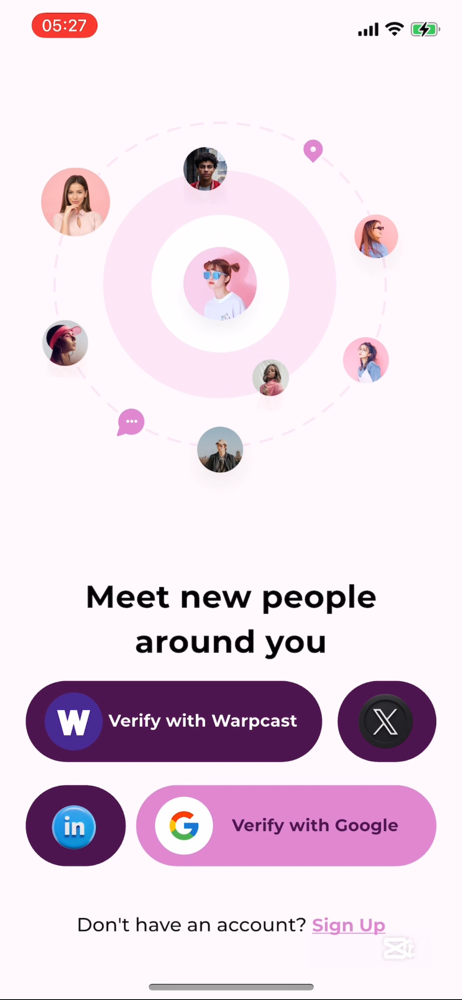
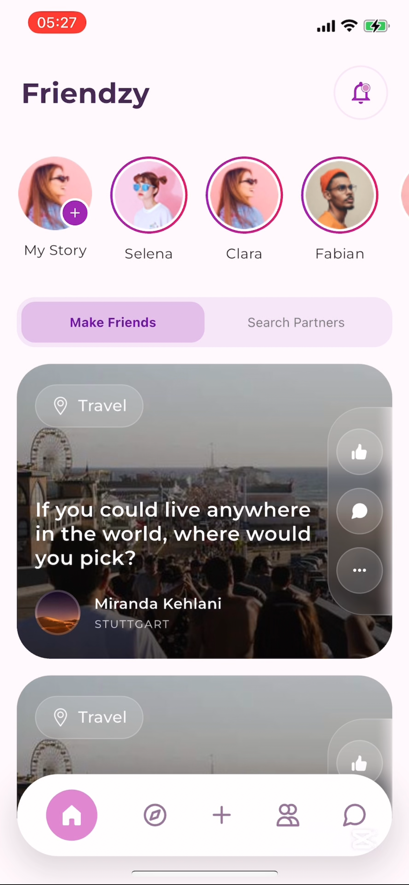
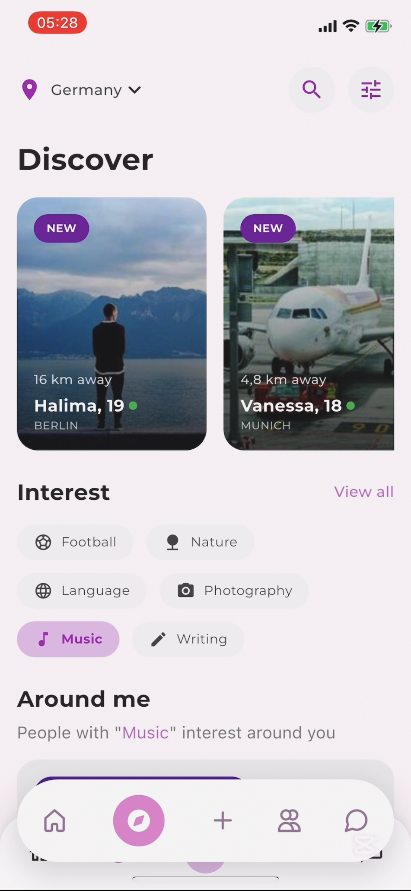
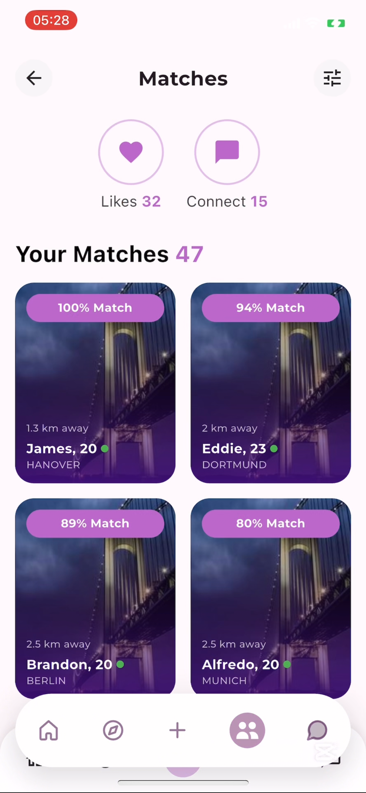
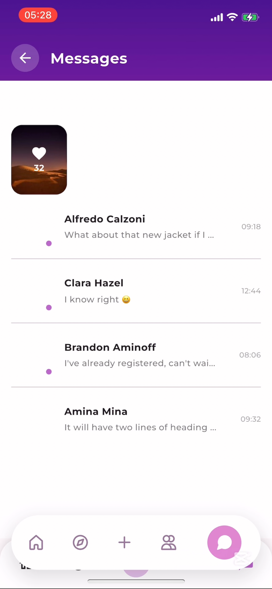

# ZKDating

**ZKDating** is a privacy-focused dating application leveraging **zkTLS from Reclaim Protocol** to offer users verifiable and anonymous interactions while ensuring authenticity. It combines dating with basic social media features, providing a safe and decentralized way to connect.

**This project will be made PRIVATE after this bounty, until it has been AUDITED, then it will be OPEN SOURCE.**

Please go through this README properly to ensure you do not miss any important details.

## 📱 Live App Preview Steps

You can preview the app on iOS for a limited time with this link: [Mobile Prototype Live](https://appetize.io/app/b_iu67wiztv6ekoksj5vhh4kdpbi). If it does not work, the live preview may have expired.

### Steps to Preview:

- Click **Start the device**
- The app should open automatically
- Use a wallet like **Backpack** to sign in. However, features requiring wallet signing must be tested on a real iOS or Android device since the simulator does not support wallet integrations.

## 🚀 Features

- **Zero-Knowledge Proofs (ZK)** to verify identity without exposing personal details.
- **Reclaim Protocol integration** for verifiable credentials.
- **AI-driven matching** based on preferences and social interactions.
- **Privacy-first messaging** with end-to-end encryption.
- **Basic social media features**, such as liking and commenting.
- **Non-custodial wallet integration** for secure interactions.

## 📷 Screenshots

Below are some screenshots of the ZKDating application:

<table>
  <tr>
    <td><a href="assets/screenshots/IMG_7705.PNG"></a></td>
    <td><a href="assets/screenshots/IMG_7706.PNG"></a></td>
    <td><a href="assets/screenshots/IMG_7707.PNG"></a></td>
  </tr>
  <tr>
    <td><a href="assets/screenshots/IMG_7708.PNG"></a></td>
    <td><a href="assets/screenshots/IMG_7709.PNG"></a></td>
  </tr>
</table>

## 📂 Project Structure Overview

```
zkdating/
├── assets/
├── fonts/
├── lib/
│   ├── main.dart
│   ├── core/
│       │── constants/
│       │── extensions/
│       │── helpers/
│       │── theme/
│       │── utils/
│   ├── data/
│       │── controllers/
│       │── local/
│       │── model_data/
│       │── services/
│   ├── presentation/
│       │── components/
│       │── views/
│       │── splash.dart
│   ├── utils/
        │── locator.dart
├── pubspec.yaml
├── README.md
├── LICENSE
```

## 🎒 Prerequisites

- Flutter SDK (version 3.5.3 or higher)
- Dart SDK (version 3.5.3 or higher)
- Android Studio or Xcode (for emulator/simulator setup)

## 🛠️ Setup & Installation

Follow these steps to set up and run the Flutter frontend:

```sh
git clone https://github.com/your-repo/zkdating.git
cd zkdating/
flutter pub get
flutter run
```

## 🔗 Important Links

- [Hackthon submission on X](https://x.com/HeIsJoel0x/status/1890986498515689585)

## 📌 Roadmap

- ✅ MVP launch with core features.
- 🚧 Android optimization.
- 🔜 Multi-chain support (Solana, Base, etc.).

## 📜 License

This project is currently not licensed but will be in the near future under MIT and other standard open-source licenses.

## Acknowledgments

- Thanks to **Reclaim Protocol** for providing zkTLS for secure identity verification.
- Thanks to **SuperteamEarn** for supporting Solana-based innovations.
- Thanks to the **Flutter team** for an excellent framework for cross-platform development.
- Special thanks to **@Davejnr (SuperteamNG Owerri Devrel)** for sharing the alpha.

For any questions or issues, please open an issue on the [GitHub repository](https://github.com/your-repo/zkdating).
